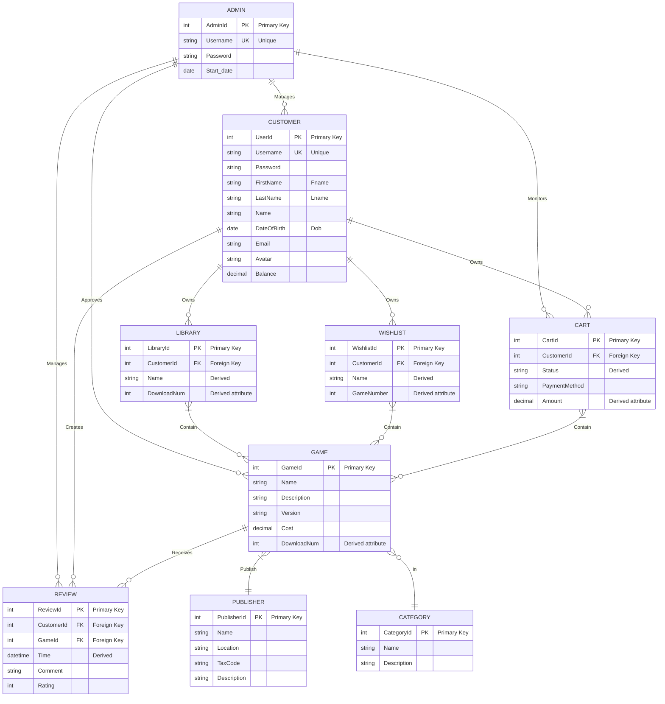

# Entity Relationship Diagram (Mermaid)

## Relationship Details

### Entity Relationships:
1. **ADMIN - CUSTOMER**: One admin can manage many customers (1:N)
2. **ADMIN - GAME**: One admin can approve many games (1:N)
3. **ADMIN - REVIEW**: One admin can manage many reviews (1:N)
4. **ADMIN - CART**: One admin can monitor many carts (1:N)

5. **CUSTOMER - REVIEW**: One customer can create many reviews (1:N)
6. **CUSTOMER - LIBRARY**: One customer owns one library (1:1)
7. **CUSTOMER - WISHLIST**: One customer owns one wishlist (1:1)
8. **CUSTOMER - CART**: One customer owns one cart (1:1)

9. **GAME - REVIEW**: One game can receive many reviews (1:N)
10. **GAME - PUBLISHER**: Many games can be published by one publisher (N:1)
11. **GAME - CATEGORY**: Many games belong to one category (N:1)

12. **LIBRARY - GAME**: Many-to-many relationship through contains
13. **WISHLIST - GAME**: Many-to-many relationship through contains
14. **CART - GAME**: Many-to-many relationship through contains

### Key Attributes:
- **Primary Keys**: Each entity has a unique identifier
- **Foreign Keys**: Relationships are maintained through foreign key references
- **Derived Attributes**: Some attributes are calculated from other data (shown with dashed lines in original)
- **Unique Keys**: Username fields are unique across the system

### Business Rules:
1. Each customer has exactly one library, wishlist, and cart
2. Games must be approved by admin before being available
3. Reviews require both customer and game to exist
4. Publishers and categories are shared across multiple games
5. Cart contains payment information for purchase processing